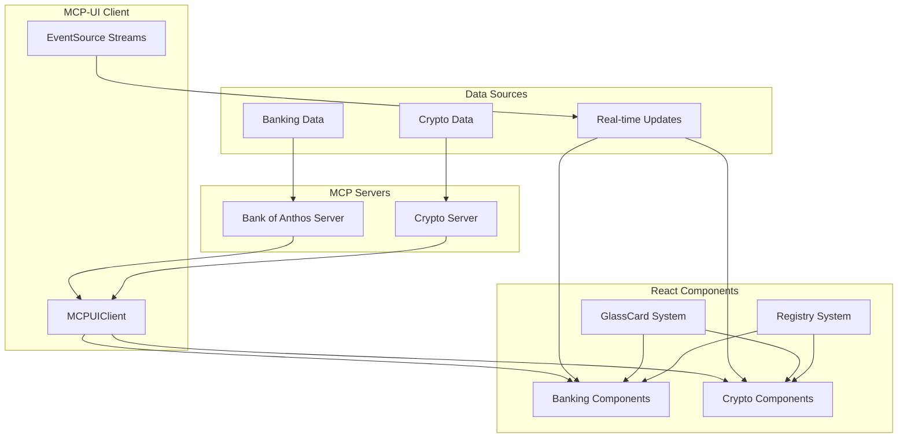
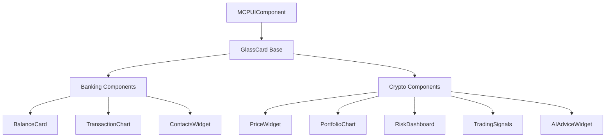

# 🪟 MCP-UI Glassmorphism Component Specifications

## 📋 Executive Summary

Detta dokument specificerar detaljerade komponent-specifikationer för MCP-UI komponenter i Felicia's Finance, byggda med glassmorphism design som följer backend-API strukturerna från banking och crypto MCP servrarna.

## 🏗️ System Architecture

### MCP-UI Data Flow Architecture



### Component Hierarchy



---

## 🏦 Banking Components

### 1. BalanceCard Component

**Backend API Integration:**
```typescript
// From: bankofanthos_managers.get_account_balance()
interface BalanceData {
  account_id: string;
  balance: number;        // In cents (divide by 100 for display)
  currency: string;       // Always "USD"
  available_balance: number;
  pending_balance: number;
}
```

**Component Specification:**
```tsx
interface BalanceCardProps {
  component: MCPUIComponent;
  // Expected component.content structure:
  // {
  //   title: "Account Balance",
  //   value: "$12,543.67",        // Formatted display value
  //   subtitle: "Available Balance",
  //   trend: "+2.3%",             // Optional 24h change
  //   trendDirection: "positive" | "negative" | "neutral",
  //   lastUpdated: "2024-01-15T10:30:00Z"
  // }
}

<GlassCard depth="surface" variant="default">
  <GlassCardHeader>
    <GlassCardTitle>Account Balance</GlassCardTitle>
  </GlassCardHeader>
  <GlassCardContent>
    <GlassCardValue>$12,543.67</GlassCardValue>
    <GlassCardSubtitle>Available Balance</GlassCardSubtitle>
    <div className="text-sm text-green-300">↗️ +2.3%</div>
    <GlassCardSubtitle>Last updated: 15 Jan 10:30</GlassCardSubtitle>
  </GlassCardContent>
</GlassCard>
```

**Visual Design:**
- **Background**: `rgba(255, 255, 255, 0.08)`
- **Border**: `rgba(255, 255, 255, 0.12)`
- **Trend Colors**: Green `rgba(34, 197, 94, 0.85)`, Red `rgba(239, 68, 68, 0.85)`
- **Value Text**: `rgba(255, 255, 255, 0.95)`, font-size: 2xl, font-weight: bold
- **Backdrop Filter**: blur(16px)

**Real-time Updates:**
- SSE Stream: `/mcp-ui/stream/balance-updates/{accountId}`
- Update frequency: Real-time on balance changes
- Fallback: Manual refresh every 30 seconds

---

### 2. TransactionChart Component

**Backend API Integration:**
```typescript
// From: bankofanthos_managers.get_transaction_history()
interface TransactionData {
  transactions: Array<{
    transaction_id: string;
    timestamp: string;
    from_account: string;
    to_account: string;
    amount: number;        // In cents
    description: string;
    type: "credit" | "debit";
    status: "completed" | "pending";
  }>;
}
```

**Component Specification:**
```tsx
interface TransactionChartProps {
  component: MCPUIComponent;
  // Expected component.content structure:
  // {
  //   title: "Transaction History",
  //   chartData: Array<{
  //     date: "2024-01-15",
  //     credits: 2500.00,
  //     debits: 1800.50,
  //     net: 699.50
  //   }>,
  //   transactions: Array<{
  //     id: string,
  //     amount: "$+250.00" | "$-180.00",
  //     description: "Salary Deposit",
  //     date: "2024-01-15",
  //     type: "credit" | "debit"
  //   }>,
  //   timeRange: "30d"
  // }
}

<GlassCard depth="surface" className="w-full">
  <GlassCardHeader>
    <GlassCardTitle>Transaction History</GlassCardTitle>
    <div className="flex gap-2">
      <GlassButton variant="outline" size="sm">7d</GlassButton>
      <GlassButton variant="outline" size="sm" active>30d</GlassButton>
      <GlassButton variant="outline" size="sm">90d</GlassButton>
    </div>
  </GlassCardHeader>
  <GlassCardContent>
    {/* Area Chart with Credits/Debits */}
    <div className="h-48 mb-4">
      <ResponsiveContainer width="100%" height="100%">
        <AreaChart data={chartData}>
          <defs>
            <linearGradient id="creditGradient" x1="0" y1="0" x2="0" y2="1">
              <stop offset="5%" stopColor="rgba(34, 197, 94, 0.3)" />
              <stop offset="95%" stopColor="rgba(34, 197, 94, 0.05)" />
            </linearGradient>
            <linearGradient id="debitGradient" x1="0" y1="0" x2="0" y2="1">
              <stop offset="5%" stopColor="rgba(239, 68, 68, 0.3)" />
              <stop offset="95%" stopColor="rgba(239, 68, 68, 0.05)" />
            </linearGradient>
          </defs>
          <Area
            type="monotone"
            dataKey="credits"
            stroke="rgba(34, 197, 94, 0.8)"
            fill="url(#creditGradient)"
          />
          <Area
            type="monotone"
            dataKey="debits"
            stroke="rgba(239, 68, 68, 0.8)"
            fill="url(#debitGradient)"
          />
        </AreaChart>
      </ResponsiveContainer>
    </div>

    {/* Transaction List */}
    <div className="space-y-2 max-h-40 overflow-y-auto">
      {transactions.map(tx => (
        <div key={tx.id} className="flex justify-between items-center py-2 px-3 rounded-lg bg-white/5">
          <div>
            <div className="text-sm text-white/95">{tx.description}</div>
            <div className="text-xs text-white/55">{tx.date}</div>
          </div>
          <div className={`text-sm font-medium ${
            tx.type === 'credit' ? 'text-green-300' : 'text-red-300'
          }`}>
            {tx.amount}
          </div>
        </div>
      ))}
    </div>
  </GlassCardContent>
</GlassCard>
```

**Chart Specifications:**
- **Library**: Recharts (React)
- **Chart Type**: Area chart with dual gradients
- **Colors**: Green gradient for credits, Red gradient for debits
- **Interactive**: Hover tooltips, time range selection
- **Responsive**: Adapts to container width

---

### 3. ContactsWidget Component

**Backend API Integration:**
```typescript
// From: bankofanthos_managers.get_contacts()
interface ContactsData {
  contacts: Array<{
    label: string;
    account_num: string;
    routing_num: string;
    is_external: boolean;
  }>;
}
```

**Component Specification:**
```tsx
interface ContactsWidgetProps {
  component: MCPUIComponent;
  // Expected component.content structure:
  // {
  //   title: "Payment Contacts",
  //   contacts: Array<{
  //     id: string,
  //     label: "Alice Johnson",
  //     accountNumber: "****1234",
  //     isExternal: true,
  //     lastUsed: "2024-01-10"
  //   }>
  // }
}

<GlassCard depth="surface" className="w-full">
  <GlassCardHeader>
    <GlassCardTitle>Payment Contacts</GlassCardTitle>
    <GlassButton variant="outline" size="sm">
      <Plus className="w-4 h-4 mr-1" />
      Add Contact
    </GlassButton>
  </GlassCardHeader>
  <GlassCardContent>
    <div className="grid grid-cols-1 gap-3">
      {contacts.map(contact => (
        <div
          key={contact.id}
          className="flex items-center justify-between p-3 rounded-lg bg-white/5 hover:bg-white/8 transition-colors cursor-pointer"
        >
          <div className="flex items-center space-x-3">
            <div className="w-8 h-8 rounded-full bg-gradient-to-br from-blue-500/20 to-purple-500/20 flex items-center justify-center">
              <User className="w-4 h-4 text-white/75" />
            </div>
            <div>
              <div className="text-sm font-medium text-white/95">{contact.label}</div>
              <div className="text-xs text-white/55">
                {contact.accountNumber}
                {contact.isExternal && <span className="ml-1 text-yellow-300/75">External</span>}
              </div>
            </div>
          </div>
          <div className="text-xs text-white/55">
            {contact.lastUsed && `Last used ${contact.lastUsed}`}
          </div>
        </div>
      ))}
    </div>
  </GlassCardContent>
</GlassCard>
```

---

## ₿ Crypto Components

### 4. PortfolioChart Component

**Backend API Integration:**
```typescript
// From: crypto_managers.MarketAnalyzer - Multiple API calls
interface PortfolioData {
  total_value: number;
  total_change_24h: number;
  total_change_pct_24h: number;
  holdings: Array<{
    token_id: string;
    symbol: string;
    name: string;
    amount: number;
    value_usd: number;
    price_usd: number;
    change_24h: number;
    change_pct_24h: number;
    allocation_pct: number;
  }>;
}
```

**Component Specification:**
```tsx
interface PortfolioChartProps {
  component: MCPUIComponent;
  // Expected component.content structure:
  // {
  //   title: "Portfolio Overview",
  //   totalValue: "$45,230.67",
  //   totalChange: "+$1,245.32",
  //   totalChangePct: "+2.83%",
  //   chartData: Array<{
  //     date: "2024-01-15",
  //     value: 45230.67,
  //     change: 1245.32
  //   }>,
  //   holdings: Array<{
  //     symbol: "BTC",
  //     name: "Bitcoin",
  //     value: "$18,450.23",
  //     change: "+$234.12",
  //     changePct: "+1.28%",
  //     allocation: "40.7%"
  //   }>
  // }
}

<GlassCard depth="surface" className="w-full">
  <GlassCardHeader>
    <GlassCardTitle>Portfolio Overview</GlassCardTitle>
    <div className="flex items-center space-x-4">
      <div>
        <GlassCardValue>$45,230.67</GlassCardValue>
        <div className="text-sm text-green-300">↗️ +$1,245.32 (+2.83%)</div>
      </div>
      <div className="flex gap-2">
        <GlassButton variant="outline" size="sm">1W</GlassButton>
        <GlassButton variant="outline" size="sm" active>1M</GlassButton>
        <GlassButton variant="outline" size="sm">3M</GlassButton>
      </div>
    </div>
  </GlassCardHeader>
  <GlassCardContent>
    {/* Portfolio Value Chart */}
    <div className="h-64 mb-6">
      <ResponsiveContainer width="100%" height="100%">
        <LineChart data={chartData}>
          <defs>
            <linearGradient id="portfolioGradient" x1="0" y1="0" x2="0" y2="1">
              <stop offset="5%" stopColor="rgba(59, 130, 246, 0.8)" />
              <stop offset="50%" stopColor="rgba(139, 92, 246, 0.6)" />
              <stop offset="95%" stopColor="rgba(236, 72, 153, 0.4)" />
            </linearGradient>
          </defs>
          <Line
            type="monotone"
            dataKey="value"
            stroke="url(#portfolioGradient)"
            strokeWidth={3}
            dot={false}
          />
          <Tooltip
            contentStyle={{
              background: 'rgba(255, 255, 255, 0.1)',
              backdropFilter: 'blur(8px)',
              border: '1px solid rgba(255, 255, 255, 0.2)',
              borderRadius: '8px'
            }}
          />
        </LineChart>
      </ResponsiveContainer>
    </div>

    {/* Holdings List */}
    <div className="space-y-3">
      {holdings.map(holding => (
        <div key={holding.symbol} className="flex items-center justify-between p-3 rounded-lg bg-white/5">
          <div className="flex items-center space-x-3">
            <div className="w-8 h-8 rounded-full bg-gradient-to-br from-blue-500/20 to-purple-500/20 flex items-center justify-center">
              <span className="text-xs font-bold text-white/95">{holding.symbol.slice(0,2)}</span>
            </div>
            <div>
              <div className="text-sm font-medium text-white/95">{holding.name}</div>
              <div className="text-xs text-white/55">{holding.symbol}</div>
            </div>
          </div>
          <div className="text-right">
            <div className="text-sm font-medium text-white/95">{holding.value}</div>
            <div className="flex items-center space-x-2">
              <span className={`text-xs ${
                holding.changePct.startsWith('+') ? 'text-green-300' : 'text-red-300'
              }`}>
                {holding.change} ({holding.changePct})
              </span>
              <span className="text-xs text-white/55">{holding.allocation}</span>
            </div>
          </div>
        </div>
      ))}
    </div>
  </GlassCardContent>
</GlassCard>
```

---

### 5. RiskDashboard Component

**Backend API Integration:**
```typescript
// From: crypto_managers.MarketAnalyzer + risk management
interface RiskMetrics {
  portfolio_risk_score: number;     // 1-10 scale
  volatility: number;              // Annualized volatility %
  sharpe_ratio: number;
  max_drawdown: number;            // Maximum drawdown %
  value_at_risk: number;           // 95% VaR %
  expected_shortfall: number;      // Expected shortfall %

  risk_breakdown: {
    market_risk: number;
    liquidity_risk: number;
    credit_risk: number;
    operational_risk: number;
  };

  recommendations: Array<{
    type: "reduce" | "diversify" | "hedge" | "monitor";
    message: string;
    priority: "high" | "medium" | "low";
  }>;
}
```

**Component Specification:**
```tsx
interface RiskDashboardProps {
  component: MCPUIComponent;
  // Expected component.content structure:
  // {
  //   title: "Risk Dashboard",
  //   riskScore: 7.2,
  //   riskLevel: "Medium-High",
  //   volatility: "24.5%",
  //   sharpeRatio: 1.85,
  //   maxDrawdown: "-12.3%",
  //   var95: "-8.7%",
  //   riskBreakdown: {
  //     market: 45,
  //     liquidity: 20,
  //     credit: 15,
  //     operational: 20
  //   },
  //   recommendations: [...]
  // }
}

<GlassCard depth="surface" className="w-full">
  <GlassCardHeader>
    <GlassCardTitle>Risk Dashboard</GlassCardTitle>
    <div className="flex items-center space-x-4">
      <div className="text-2xl font-bold text-white/95">{riskScore}/10</div>
      <div className={`px-3 py-1 rounded-full text-sm font-medium ${
        riskLevel === 'Low' ? 'bg-green-500/20 text-green-300' :
        riskLevel === 'Medium' ? 'bg-yellow-500/20 text-yellow-300' :
        'bg-red-500/20 text-red-300'
      }`}>
        {riskLevel} Risk
      </div>
    </div>
  </GlassCardHeader>
  <GlassCardContent>
    {/* Key Metrics Grid */}
    <div className="grid grid-cols-2 md:grid-cols-4 gap-4 mb-6">
      <div className="text-center">
        <div className="text-sm text-white/75">Volatility</div>
        <div className="text-lg font-bold text-white/95">{volatility}</div>
      </div>
      <div className="text-center">
        <div className="text-sm text-white/75">Sharpe Ratio</div>
        <div className="text-lg font-bold text-white/95">{sharpeRatio}</div>
      </div>
      <div className="text-center">
        <div className="text-sm text-white/75">Max Drawdown</div>
        <div className="text-lg font-bold text-red-300">{maxDrawdown}</div>
      </div>
      <div className="text-center">
        <div className="text-sm text-white/75">VaR (95%)</div>
        <div className="text-lg font-bold text-yellow-300">{var95}</div>
      </div>
    </div>

    {/* Risk Breakdown Pie Chart */}
    <div className="h-48 mb-6">
      <ResponsiveContainer width="100%" height="100%">
        <PieChart>
          <Pie
            data={[
              { name: 'Market Risk', value: riskBreakdown.market, fill: 'rgba(239, 68, 68, 0.8)' },
              { name: 'Liquidity Risk', value: riskBreakdown.liquidity, fill: 'rgba(251, 191, 36, 0.8)' },
              { name: 'Credit Risk', value: riskBreakdown.credit, fill: 'rgba(34, 197, 94, 0.8)' },
              { name: 'Operational Risk', value: riskBreakdown.operational, fill: 'rgba(59, 130, 246, 0.8)' }
            ]}
            cx="50%" cy="50%" innerRadius={40} outerRadius={80}
          />
          <Tooltip />
        </PieChart>
      </ResponsiveContainer>
    </div>

    {/* Recommendations */}
    <div className="space-y-3">
      <GlassCardTitle className="text-base">Recommendations</GlassCardTitle>
      {recommendations.map((rec, index) => (
        <div key={index} className={`p-3 rounded-lg border-l-4 ${
          rec.priority === 'high' ? 'border-l-red-400 bg-red-500/10' :
          rec.priority === 'medium' ? 'border-l-yellow-400 bg-yellow-500/10' :
          'border-l-green-400 bg-green-500/10'
        }`}>
          <div className="text-sm text-white/95">{rec.message}</div>
          <div className={`text-xs mt-1 ${
            rec.priority === 'high' ? 'text-red-300' :
            rec.priority === 'medium' ? 'text-yellow-300' :
            'text-green-300'
          }`}>
            {rec.priority.toUpperCase()} PRIORITY
          </div>
        </div>
      ))}
    </div>
  </GlassCardContent>
</GlassCard>
```

---

### 6. TradingSignals Component

**Backend API Integration:**
```typescript
// From: crypto_managers.MarketAnalyzer.generate_signal()
interface TradingSignal {
  success: boolean;
  token_id: string;
  signal: "BUY" | "SELL" | "HOLD";
  confidence: number;              // 0-1 scale
  probability: number;            // 0-1 scale
  timestamp: string;
  technical_indicators: {
    rsi: number;
    macd: { signal: number; histogram: number; };
    moving_averages: { sma_20: number; sma_50: number; };
    bollinger_bands: { upper: number; middle: number; lower: number; };
  };
  analysis_summary: string;
}
```

**Component Specification:**
```tsx
interface TradingSignalsProps {
  component: MCPUIComponent;
  // Expected component.content structure:
  // {
  //   title: "Trading Signals",
  //   signals: Array<{
  //     token: "BTC",
  //     signal: "BUY",
  //     confidence: 0.78,
  //     probability: 0.72,
  //     analysis: "Strong bullish momentum detected...",
  //     indicators: { rsi: 65, macd: {...}, ... },
  //     timestamp: "2024-01-15T14:30:00Z"
  //   }>
  // }
}

<GlassCard depth="surface" className="w-full">
  <GlassCardHeader>
    <GlassCardTitle>Trading Signals</GlassCardTitle>
    <div className="flex gap-2">
      <GlassButton variant="outline" size="sm" active>All</GlassButton>
      <GlassButton variant="outline" size="sm">BTC</GlassButton>
      <GlassButton variant="outline" size="sm">ETH</GlassButton>
    </div>
  </GlassCardHeader>
  <GlassCardContent>
    <div className="space-y-4">
      {signals.map(signal => (
        <div key={`${signal.token}-${signal.timestamp}`} className="p-4 rounded-lg bg-white/5">
          {/* Signal Header */}
          <div className="flex items-center justify-between mb-3">
            <div className="flex items-center space-x-3">
              <div className={`px-3 py-1 rounded-full text-sm font-bold ${
                signal.signal === 'BUY' ? 'bg-green-500/20 text-green-300' :
                signal.signal === 'SELL' ? 'bg-red-500/20 text-red-300' :
                'bg-gray-500/20 text-gray-300'
              }`}>
                {signal.signal}
              </div>
              <div>
                <div className="text-lg font-bold text-white/95">{signal.token}</div>
                <div className="text-sm text-white/55">
                  {new Date(signal.timestamp).toLocaleString()}
                </div>
              </div>
            </div>
            <div className="text-right">
              <div className="text-sm text-white/75">Confidence</div>
              <div className="text-lg font-bold text-white/95">
                {(signal.confidence * 100).toFixed(0)}%
              </div>
            </div>
          </div>

          {/* Technical Indicators */}
          <div className="grid grid-cols-2 md:grid-cols-4 gap-3 mb-3">
            <div className="text-center">
              <div className="text-xs text-white/75">RSI</div>
              <div className={`text-sm font-medium ${
                signal.indicators.rsi > 70 ? 'text-red-300' :
                signal.indicators.rsi < 30 ? 'text-green-300' :
                'text-white/95'
              }`}>
                {signal.indicators.rsi.toFixed(1)}
              </div>
            </div>
            <div className="text-center">
              <div className="text-xs text-white/75">MACD</div>
              <div className="text-sm font-medium text-white/95">
                {signal.indicators.macd.signal > 0 ? '+' : ''}
                {signal.indicators.macd.signal.toFixed(4)}
              </div>
            </div>
            <div className="text-center">
              <div className="text-xs text-white/75">Price vs SMA20</div>
              <div className={`text-sm font-medium ${
                signal.price > signal.indicators.moving_averages.sma_20 ? 'text-green-300' : 'text-red-300'
              }`}>
                {signal.price > signal.indicators.moving_averages.sma_20 ? 'Above' : 'Below'}
              </div>
            </div>
            <div className="text-center">
              <div className="text-xs text-white/75">BB Position</div>
              <div className="text-sm font-medium text-white/95">
                {((signal.price - signal.indicators.bollinger_bands.lower) /
                  (signal.indicators.bollinger_bands.upper - signal.indicators.bollinger_bands.lower) * 100).toFixed(0)}%
              </div>
            </div>
          </div>

          {/* Analysis Summary */}
          <div className="text-sm text-white/75 bg-white/5 p-3 rounded">
            {signal.analysis}
          </div>
        </div>
      ))}
    </div>
  </GlassCardContent>
</GlassCard>
```

---

### 7. AIAdviceWidget Component (XGBoost ML)

**Backend API Integration:**
```typescript
// From: crypto_managers.XGBoostAIManager.get_ai_trading_advice()
interface AIAdvice {
  success: boolean;
  token_id: string;
  model_version: string;
  ai_signal: "BUY" | "SELL" | "HOLD";
  confidence: number;              // 0-1 scale
  probability: number;            // 0-1 scale
  timestamp: string;
  recommendation: {
    action: string;               // "STRONGLY BUY", "BUY", etc.
    urgency: "high" | "medium" | "low";
    timeframe: string;            // "short-term (1-3 days)"
    confidence_level: "high" | "medium" | "low";
  };
  risk_assessment: {
    risk_level: "low" | "medium" | "high";
    risk_score: number;           // 1-10 scale
    position_size_suggestion: string; // "25%", "10%", etc.
    stop_loss_required: boolean;
  };
  expected_return: {
    expected_return_pct: number;
    confidence_interval: string;  // "±5.2%"
    time_horizon_days: number;
    based_on_historical_data: boolean;
  };
  explanation: string;
  backtest_performance?: {
    total_return: number;
    win_rate: number;
    sharpe_ratio: number;
    max_drawdown: number;
  };
}
```

**Component Specification:**
```tsx
interface AIAdviceWidgetProps {
  component: MCPUIComponent;
  // Expected component.content structure:
  // {
  //   title: "AI Trading Advisor",
  //   advice: {
  //     tokenId: "BTC",
  //     aiSignal: "BUY",
  //     confidence: 0.84,
  //     recommendation: { action: "STRONGLY BUY", urgency: "high", ... },
  //     riskAssessment: { riskLevel: "medium", riskScore: 6, ... },
  //     expectedReturn: { expectedReturnPct: 5.2, ... },
  //     explanation: "XGBoost model detects strong bullish pattern...",
  //     backtestPerformance: { totalReturn: 0.125, winRate: 0.68, ... }
  //   }
  // }
}

<GlassCard depth="elevated" className="w-full" variant="interactive">
  <GlassCardHeader>
    <GlassCardTitle>AI Trading Advisor</GlassCardTitle>
    <div className="flex items-center space-x-3">
      <div className="flex items-center space-x-2">
        <Brain className="w-5 h-5 text-blue-300" />
        <span className="text-sm text-white/75">XGBoost ML Model</span>
      </div>
      <div className="text-sm text-white/55">v{advice.modelVersion}</div>
    </div>
  </GlassCardHeader>
  <GlassCardContent>
    {/* Main Recommendation */}
    <div className="text-center mb-6">
      <div className={`inline-flex items-center px-6 py-3 rounded-full text-xl font-bold mb-2 ${
        advice.aiSignal === 'BUY' ? 'bg-green-500/20 text-green-300' :
        advice.aiSignal === 'SELL' ? 'bg-red-500/20 text-red-300' :
        'bg-gray-500/20 text-gray-300'
      }`}>
        {advice.aiSignal === 'BUY' && <TrendingUp className="w-6 h-6 mr-2" />}
        {advice.aiSignal === 'SELL' && <TrendingDown className="w-6 h-6 mr-2" />}
        {advice.recommendation.action}
      </div>
      <div className="text-sm text-white/75">
        Confidence: {(advice.confidence * 100).toFixed(1)}%
      </div>
    </div>

    {/* Key Metrics Grid */}
    <div className="grid grid-cols-2 gap-4 mb-6">
      <div className="text-center p-3 rounded-lg bg-white/5">
        <div className="text-sm text-white/75">Expected Return</div>
        <div className="text-lg font-bold text-white/95">
          +{advice.expectedReturn.expectedReturnPct.toFixed(1)}%
        </div>
        <div className="text-xs text-white/55">
          {advice.expectedReturn.confidenceInterval} CI
        </div>
      </div>
      <div className="text-center p-3 rounded-lg bg-white/5">
        <div className="text-sm text-white/75">Risk Level</div>
        <div className={`text-lg font-bold ${
          advice.riskAssessment.riskLevel === 'low' ? 'text-green-300' :
          advice.riskAssessment.riskLevel === 'medium' ? 'text-yellow-300' :
          'text-red-300'
        }`}>
          {advice.riskAssessment.riskLevel.toUpperCase()}
        </div>
        <div className="text-xs text-white/55">
          Score: {advice.riskAssessment.riskScore}/10
        </div>
      </div>
    </div>

    {/* Risk Assessment */}
    <div className="mb-4">
      <GlassCardTitle className="text-base mb-2">Risk Assessment</GlassCardTitle>
      <div className="space-y-2">
        <div className="flex justify-between text-sm">
          <span className="text-white/75">Position Size:</span>
          <span className="text-white/95">{advice.riskAssessment.positionSizeSuggestion}</span>
        </div>
        <div className="flex justify-between text-sm">
          <span className="text-white/75">Stop Loss:</span>
          <span className={`${
            advice.riskAssessment.stopLossRequired ? 'text-yellow-300' : 'text-green-300'
          }`}>
            {advice.riskAssessment.stopLossRequired ? 'Required' : 'Optional'}
          </span>
        </div>
      </div>
    </div>

    {/* Backtest Performance (if available) */}
    {advice.backtestPerformance && (
      <div className="mb-4">
        <GlassCardTitle className="text-base mb-2">Backtest Performance</GlassCardTitle>
        <div className="grid grid-cols-2 gap-3">
          <div className="text-center p-2 rounded bg-white/5">
            <div className="text-xs text-white/75">Total Return</div>
            <div className="text-sm font-medium text-green-300">
              +{(advice.backtestPerformance.totalReturn * 100).toFixed(1)}%
            </div>
          </div>
          <div className="text-center p-2 rounded bg-white/5">
            <div className="text-xs text-white/75">Win Rate</div>
            <div className="text-sm font-medium text-white/95">
              {(advice.backtestPerformance.winRate * 100).toFixed(0)}%
            </div>
          </div>
        </div>
      </div>
    )}

    {/* AI Explanation */}
    <div className="p-3 rounded-lg bg-blue-500/10 border border-blue-500/20">
      <div className="flex items-start space-x-2">
        <Brain className="w-4 h-4 text-blue-300 mt-0.5" />
        <div className="text-sm text-white/95">{advice.explanation}</div>
      </div>
    </div>
  </GlassCardContent>
</GlassCard>
```

---

## 🔄 Real-time Streaming Integration

### EventSource Streams Configuration

```typescript
// Banking Streams
const balanceStream = mcpUIClient.subscribeToBalanceUpdates(accountId, token, (data) => {
  // Update balance card
  setBalanceData(prev => ({ ...prev, ...data }));
});

const transactionStream = mcpUIClient.subscribeToTransactionNotifications(accountId, token, (data) => {
  // Add new transaction to chart
  setTransactions(prev => [data, ...prev]);
});

// Crypto Streams
const priceStream = mcpUIClient.subscribeToPriceUpdates(tokenId, token, (data) => {
  // Update price widget with real-time data
  setPriceData(prev => ({ ...prev, ...data }));
});

const portfolioStream = mcpUIClient.subscribeToPortfolioUpdates(token, (data) => {
  // Update portfolio chart
  setPortfolioData(prev => ({ ...prev, ...data }));
});

const signalsStream = mcpUIClient.subscribeToTradingSignals(token, (data) => {
  // Add new trading signal
  setSignals(prev => [data, ...prev]);
});
```

### Stream Error Handling

```typescript
// Automatic reconnection with exponential backoff
class StreamManager {
  private reconnectAttempts = 0;
  private maxReconnectAttempts = 5;
  private reconnectDelay = 1000;

  connect(streamType: string, url: string, onMessage: (data: any) => void) {
    const eventSource = new EventSource(url);

    eventSource.onmessage = (event) => {
      try {
        const data = JSON.parse(event.data);
        onMessage(data);
        this.reconnectAttempts = 0; // Reset on success
      } catch (error) {
        console.error(`Failed to parse ${streamType} data:`, error);
      }
    };

    eventSource.onerror = (error) => {
      console.error(`${streamType} stream error:`, error);
      this.attemptReconnect(streamType, url, onMessage);
    };

    return eventSource;
  }

  private attemptReconnect(streamType: string, url: string, onMessage: (data: any) => void) {
    if (this.reconnectAttempts < this.maxReconnectAttempts) {
      this.reconnectAttempts++;
      const delay = this.reconnectDelay * Math.pow(2, this.reconnectAttempts - 1);

      setTimeout(() => {
        console.log(`Attempting to reconnect ${streamType} stream (attempt ${this.reconnectAttempts})`);
        this.connect(streamType, url, onMessage);
      }, delay);
    } else {
      console.error(`Max reconnection attempts reached for ${streamType} stream`);
    }
  }
}
```

---

## ♿ Accessibility & Performance

### Accessibility Specifications

- **Color Contrast**: Minimum 4.5:1 ratio for text on glass backgrounds
- **Focus Indicators**: High contrast focus rings with `box-shadow: 0 0 0 2px rgba(59, 130, 246, 0.5)`
- **Keyboard Navigation**: Full keyboard support for all interactive elements
- **Screen Reader Support**: Proper ARIA labels and roles
- **Reduced Motion**: Respects `prefers-reduced-motion` media query

### Performance Requirements

- **First Paint**: < 1.5 seconds
- **Largest Contentful Paint**: < 2.5 seconds
- **Cumulative Layout Shift**: < 0.1
- **Bundle Size**: < 500KB (gzipped)
- **Memory Usage**: < 50MB for typical usage

### Browser Support

- **Chrome**: 76+ (backdrop-filter support)
- **Firefox**: 70+
- **Safari**: 9+
- **Edge**: 17+

### Fallback Strategy

```css
/* CSS fallback for browsers without backdrop-filter */
@supports not (backdrop-filter: blur(16px)) {
  .glass-card {
    background: rgba(255, 255, 255, 0.95);
    border: 1px solid rgba(0, 0, 0, 0.1);
    box-shadow: 0 8px 32px rgba(0, 0, 0, 0.1);
  }
}
```

---

## 📊 Implementation Roadmap

### Phase 1: Core Components (Week 1-2)
- ✅ Complete glassmorphism design system
- 🔄 Implement BalanceCard, PriceWidget components
- 🔄 Set up MCP-UI client and registry system

### Phase 2: Banking Components (Week 3)
- 🔄 TransactionChart with real-time updates
- 🔄 ContactsWidget with add/edit functionality
- 🔄 Banking dashboard layout

### Phase 3: Crypto Components (Week 4)
- 🔄 PortfolioChart with holdings breakdown
- 🔄 RiskDashboard with metrics visualization
- 🔄 TradingSignals component

### Phase 4: AI Features (Week 5)
- 🔄 AIAdviceWidget with XGBoost integration
- 🔄 Backtest performance visualization
- 🔄 ML model status indicators

### Phase 5: Polish & Optimization (Week 6)
- 🔄 Accessibility audit and fixes
- 🔄 Performance optimization
- 🔄 Cross-device testing
- 🔄 Error boundary implementation

This specification provides the foundation for a sophisticated, accessible, and performant MCP-UI system that seamlessly integrates banking and crypto data into beautiful glassmorphism components.