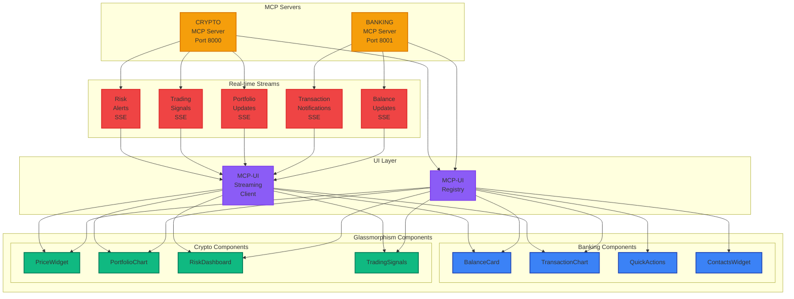
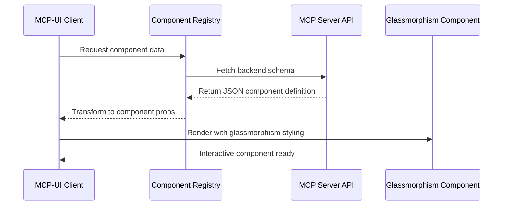
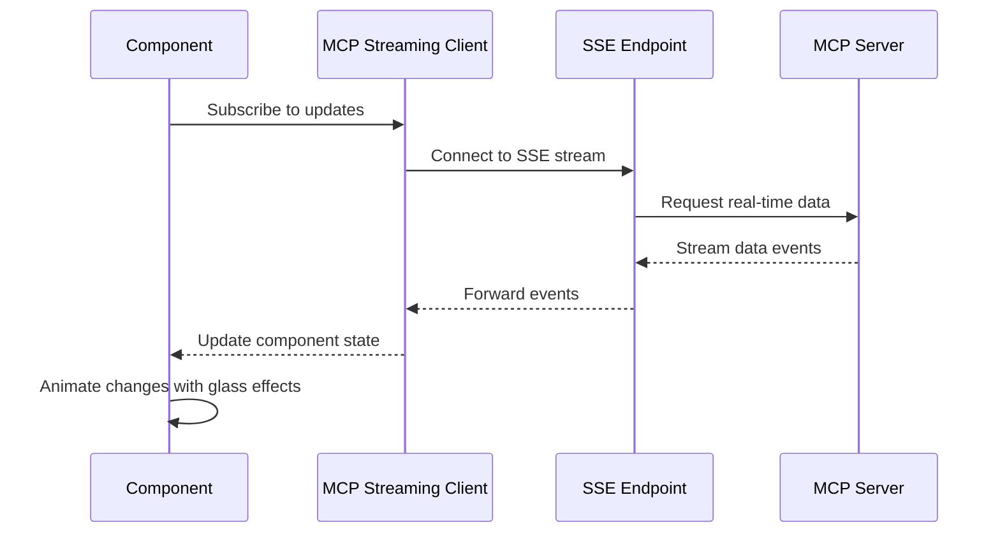
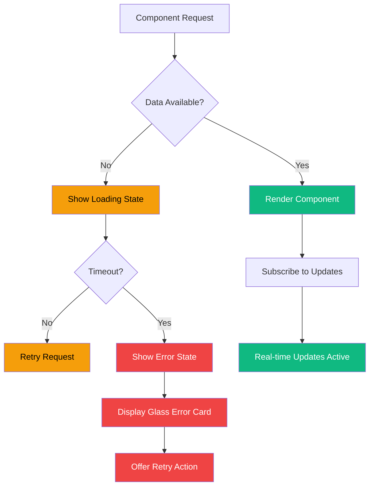

# MCP-UI Data Flow Architecture

## 🏗️ Component Hierarchy & Data Flow



## 🔄 Detailed Data Flow Patterns

### 1. Component Initialization Flow



### 2. Real-time Update Flow



### 3. Error Handling Flow



## 📊 Component State Management

### Banking Component States

```typescript
interface BankingComponentState {
  balance: {
    value: number;
    change: number;
    changeType: 'positive' | 'negative' | 'neutral';
    lastUpdated: Date;
    isLoading: boolean;
    error?: string;
  };
  transactions: {
    data: Transaction[];
    isLoading: boolean;
    lastUpdated: Date;
    error?: string;
  };
  contacts: {
    data: Contact[];
    isLoading: boolean;
    error?: string;
  };
}
```

### Crypto Component States

```typescript
interface CryptoComponentState {
  portfolio: {
    totalValue: number;
    change24h: number;
    changeType: 'positive' | 'negative' | 'neutral';
    holdings: Holding[];
    lastUpdated: Date;
    isLoading: boolean;
    error?: string;
  };
  signals: {
    data: TradingSignal[];
    lastUpdated: Date;
    isLoading: boolean;
    error?: string;
  };
  risk: {
    metrics: RiskMetrics;
    level: 'low' | 'moderate' | 'high';
    recommendations: string[];
    lastUpdated: Date;
    isLoading: boolean;
    error?: string;
  };
}
```

## 🔄 Update Patterns

### 1. Balance Updates (30-second intervals)
```typescript
const handleBalanceUpdate = (event: BalanceUpdateEvent) => {
  setBalance(prev => ({
    ...prev,
    value: event.balance,
    change: event.change,
    changeType: event.change > 0 ? 'positive' : 'negative',
    lastUpdated: new Date(event.timestamp)
  }));

  // Trigger glassmorphism animation
  triggerBalanceAnimation();
};
```

### 2. Chart Data Updates (60-second intervals)
```typescript
const handleChartUpdate = (event: ChartUpdateEvent) => {
  setChartData(prev => {
    const newData = [...prev, ...event.newPoints];
    return newData.slice(-50); // Keep last 50 points
  });

  // Smooth transition animation
  animateChartTransition();
};
```

### 3. Signal Updates (2-minute intervals)
```typescript
const handleSignalUpdate = (event: SignalUpdateEvent) => {
  setSignals(prev => {
    const updated = prev.map(signal =>
      event.signals.find(s => s.token_id === signal.token_id) || signal
    );

    // Add new signals with animation
    const newSignals = event.signals.filter(signal =>
      !prev.some(s => s.token_id === signal.token_id)
    );

    return [...updated, ...newSignals];
  });

  // Animate new signals in
  animateSignalEntrance(newSignals);
};
```

## 🚨 Error Recovery Patterns

### Network Error Handling
```typescript
const handleNetworkError = (error: NetworkError) => {
  setErrorState({
    type: 'network',
    message: 'Connection lost. Retrying...',
    retryCount: error.retryCount
  });

  // Show glass error overlay
  showErrorOverlay();

  // Auto-retry with exponential backoff
  retryWithBackoff();
};
```

### Data Validation Error
```typescript
const handleDataError = (error: DataError) => {
  setErrorState({
    type: 'data',
    message: 'Invalid data received. Using cached data.',
    fallbackData: getCachedData()
  });

  // Maintain UI stability
  showFallbackData();
};
```

This architecture ensures seamless integration between MCP server responses and glassmorphism UI components, with robust error handling and smooth real-time updates.